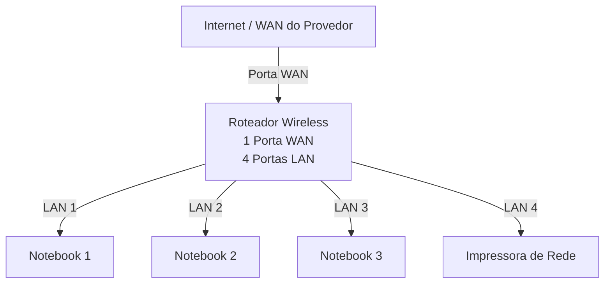
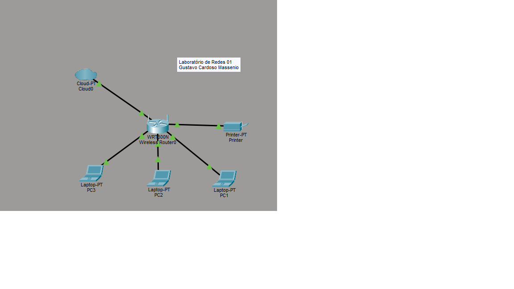
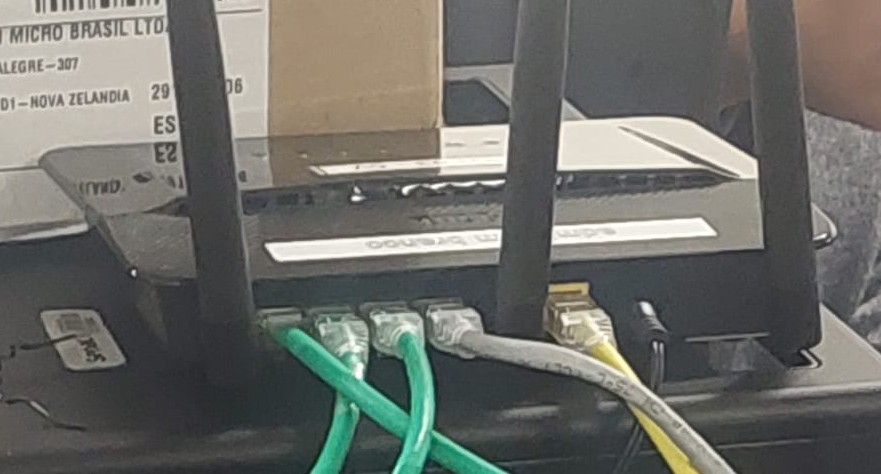
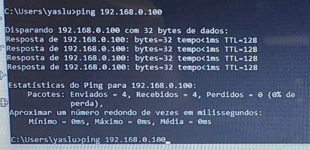

# Laboratório de Redes 01 - Projeto de Rede Local

Aluno: Gustavo Cardoso Massenio

Professor: José de Assis

---

Data: 09/03/2026

## 1. Objetivo
Implementar uma rede local simples conectando 3 notebooks a um roteador wireless com switch e uma impressora de rede.

O projeto será dividido em duas etapas:

1. Simulção da rede no Cisco Packet Tracer
2. Implementação da rede no laboratório real.

---

## 2. Equipamentos utilizados neste laboratório:

- 3 notebooks
- 1 roteador wireless com uma porta WAN e 4 portas LAN
- 1 impressora de rede
- cabos de rede

---

## 3. Topologia da Rede

Diagrama lógico da rede usada neste laboratório.

Imagem da Topologia usada neste laboratório:

---

## 4. Plano de endereçamento de IP

Rede:192.168.0.0/24

Gateway: 192.168.0.1

| Dispositivo | Tipo de IP | Endereço IP | Observação |
|-------------|-------------|-------------|-------------|
| Roteador | Estático | 192.168.0.1 | IP do roteador |
| Impressora | Reserva DHCP | 192.168.0.100 | IP reservado pelo roteador |
| PC1 | Reserva DHCP | 192.168.0.101 | IP reservado pelo roteador |
| PC2 | DHCP | Automático | IP atribuído pelo roteador |
| PC3 | DHCP | Automático | IP atribuído pelo roteador |

**Observação**

- A impressora e um dos notebooks utilizam DHCP
- O roteador sempre atribui o mesmo endereço IP a esses dispositivos.

---

## 5. Implementação do laboratório real

Após a instalação, a rede foi montada fisicamente no laboratório.

Etapas realizadas:

Testes:

---

## 6. Conslusão

Este laboratório permitiu compreender o funcionamento de uma rede local simples, incluindo:

- Estrutura de uma rede dómestica ou de pequeno escritório
- Utilização de um roteador com porta WAN
- Funcionameneto do DHCP
- Comunicação entre dispositivos na rede local
- Utilização de uma impressora de rede
- Compartilhamento de pasta na rede usando o Windows
- Jogos em rede local

